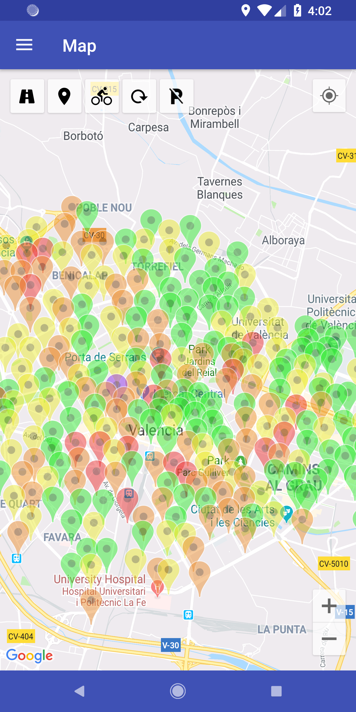
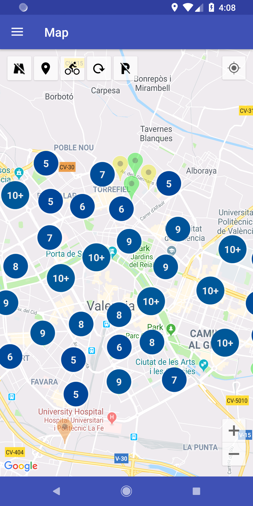
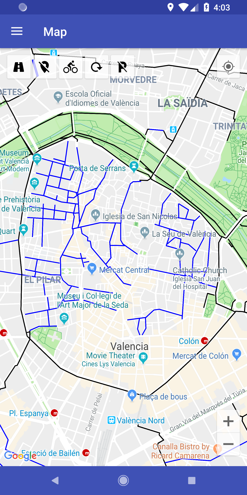
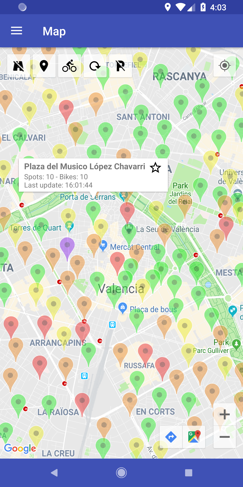
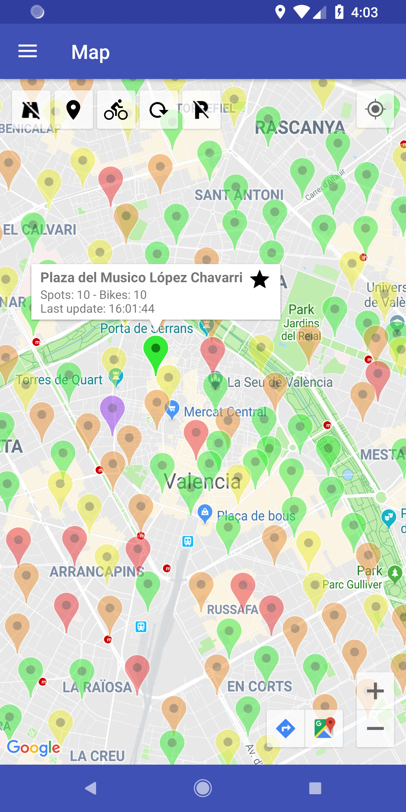
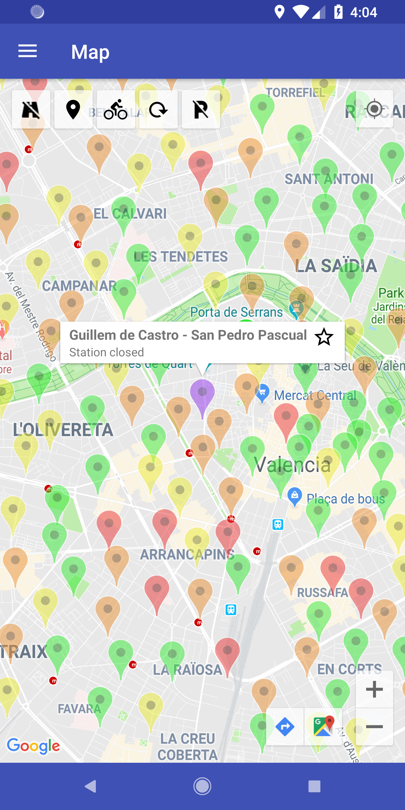
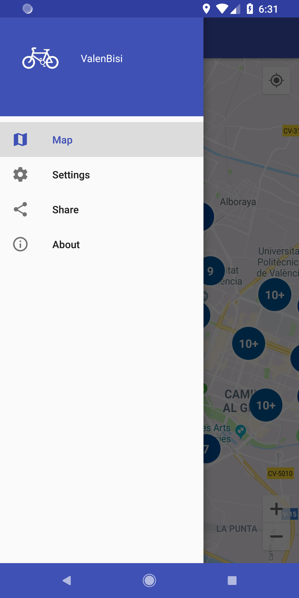
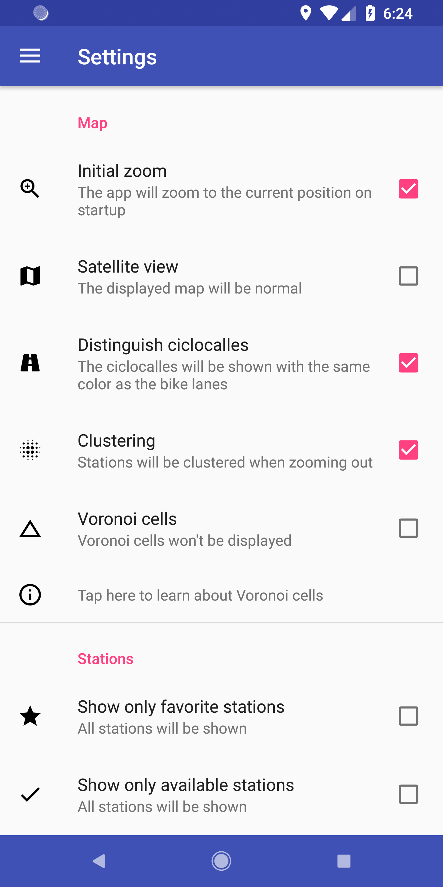
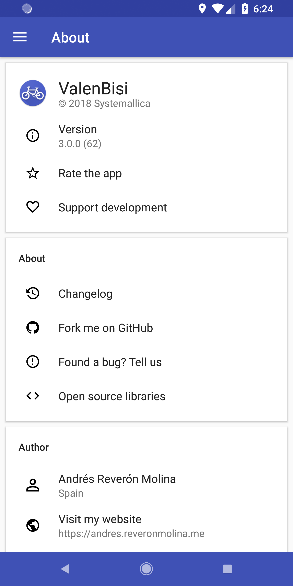

# Map for ValenBisi

Map for ValenBisi is an Android application designed to be useful to the users of the public bike network in Valencia. With this in mind, Map for ValenBisi displays real-time information about the bike stations all around the city, in a clean, easy-to-use and colorful way. 

You can use this app to see where the stations are located, how many bikes are there in each station and how many places to leave your bike are left. Besides, you can choose between a wide range of options to customize the app to your liking, and display different types of information.

It has been developed using the Material Design guidelines provided by Google, and it will always be open source.

## Screenshots

### Map

| Main view                          | Clustering ON                             | Bike lanes ON                   |
| ---------------------------------- | ----------------------------------------- | ------------------------------- |
|  |  |  |

### Stations

| Normal station                     | Favourite station                   | Closed station                            |
| ---------------------------------- | ----------------------------------- | ----------------------------------------- |
| |  |  |

### Menu

| Drawer                             | Options                             | About                          |
| ---------------------------------- | ----------------------------------- | ------------------------------ |
|   |  |  |

## Features:

* Colorful display of bike stations
* Latest bike lanes' data
* Public bike parking spots data
* Google Maps integration, calculate your route to a bike station
* Option to mark a station as favorite
* Option to show only favorite stations
* Option to show only available stations
* Option to choose between going on foot or on bike
* Option to choose the displayed map
* Option to zoom to current location on app start-up
* Option to show bike lanes on app start-up
* Option to show Voronoi cells on the map
* Option to show free bike parking spots
* Option to show map as satellite view
* Option to cluster stations on zoom out
* Toggle bike lanes
* Toggle stations
* Refresh data
* Easy, simple and clean interface
* Multiple languages: Spanish, English, French and Catalan
* Material design
* Constant updates and improvements

### Contact:

If you have any problem with the app you can open an issue here on GitHub or email me at:

andres@reveronmolina.me
